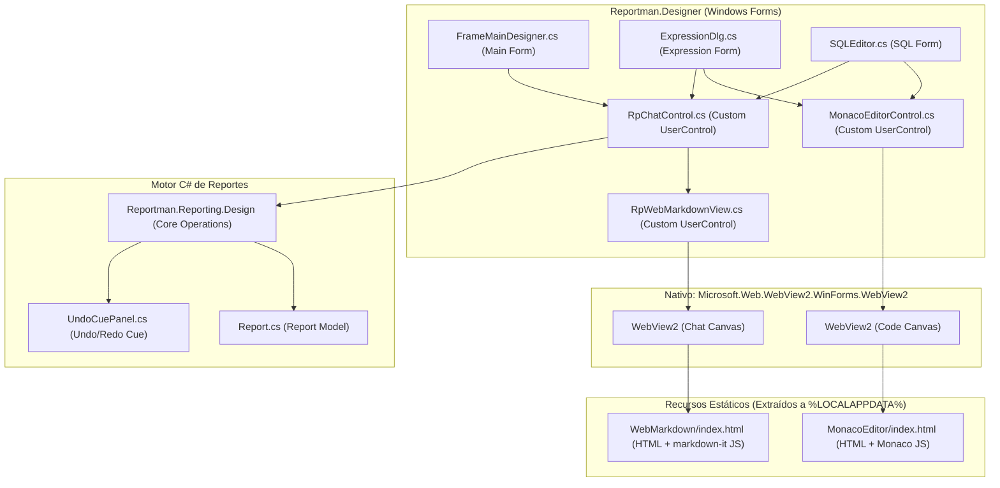

# Plan de Migración Detallado: Chat de IA, Monaco Editor y Copilot en C# (Reportman.Designer)
## Implementación Nativa y Pura en Windows Forms (Sin Dependencias WPF)

Este documento detalla la evaluación técnica y el mapa de ruta paso a paso (ordenado estrictamente por dependencias) para migrar las características enriquecidas de inteligencia artificial, Monaco Editor, SQL dialog, editor de expresiones y Copilot principal desde Delphi VCL al entorno de C# dentro de **`Reportman.Designer`**.

De acuerdo con las restricciones del proyecto, este plan **descarta por completo cualquier uso de WPF** o integraciones híbridas. Toda la interfaz de usuario del diseñador continuará siendo **100% Windows Forms nativo**, utilizando la versión oficial para WinForms de `Microsoft.Web.WebView2` para hospedar las experiencias web ligeras (Monaco y Markdown Rendering).

---

## 1. Arquitectura de Componentes en Windows Forms

Para replicar con exactitud la modularidad y fluidez de la versión Delphi VCL, encapsularemos los comportamientos web de WebView2 dentro de controles de usuario de Windows Forms reutilizables.



---

## 2. Estrategia de Empaquetado y Extracción de Recursos

Al igual que en Delphi, empaquetaremos los directorios estáticos de frontend como recursos incrustados (Embedded Resources) en el ensamblado `Reportman.Designer.dll` para evitar requerir archivos externos sueltos en despliegues NuGet:

1. **`MonacoEditor.zip`** (Contiene el index.html de Monaco, las librerías `vs/` de Monaco y las carpetas de cargadores nativos `x86/WebView2Loader.dll` y `x64/WebView2Loader.dll`).
2. **`WebMarkdown.zip`** (Contiene el visor HTML y `markdown-it.min.js` para renderizar el chat y logs formateados).

Un administrador de recursos en C# (`AssetsManager.cs`) gestionará de manera automática y perezosa en el arranque la descompresión y validación de versión en `%LOCALAPPDATA%\Reportman\Monaco` y `%LOCALAPPDATA%\Reportman\WebMarkdown` respectivamente, además de invocar `LoadLibrary` sobre el `WebView2Loader.dll` nativo adecuado según la arquitectura actual de ejecución del proceso (x86 o x64).

---

## 3. Mapa de Ruta de Implementación Paso a Paso (Orden de Dependencias)

A continuación, se define la secuencia técnica ordenada de forma que cada fase resuelva los habilitadores necesarios para la siguiente, reduciendo la fricción en el desarrollo.

```
[ Paso 1: Habilitador WebView2 ] ──> [ Paso 2: Controles Base Monaco/MD ] ──> [ Paso 3: RpChatControl ] 
                                                                                   │
    ┌──────────────────────────────────────────────────────────────────────────────┘
    ▼
[ Paso 4: Editor SQL ] ──> [ Paso 5: Diálogo Expresiones ] ──> [ Paso 6: Copilot Main Designer ]
```

---

### PASO 1: Habilitador de WebView2 e Infraestructura Base (.csproj)
*Esta tarea inicial establece la infraestructura de compilación y los recursos de datos embebidos.*

*   **Proyecto:** `Reportman.Designer.csproj`.
*   **Acciones:**
    1.  Añadir la PackageReference oficial para WebView2:
        ```xml
        <PackageReference Include="Microsoft.Web.WebView2" Version="1.0.3800.47" />
        ```
    2.  Incrustar los archivos `MonacoEditor.zip` y `WebMarkdown.zip` dentro del proyecto como `<EmbeddedResource>`.
    3.  Escribir una clase estática de infraestructura `AssetsManager.cs` en C# que:
        *   Obtenga la ruta segura de configuración en `%LOCALAPPDATA%\Reportman`.
        *   Verifique la firma/versión del zip actual contra la carpeta de destino. Si es distinta o inexistente, borre y extraiga el recurso embebido correspondiente de forma limpia.
        *   Identifique si el proceso de C# se ejecuta en 32 o 64 bits y llame a la función nativa del sistema `LoadLibrary` pasándole la ruta exacta de `%LOCALAPPDATA%\Reportman\Monaco\MonacoEditor\x86\WebView2Loader.dll` o `x64\WebView2Loader.dll` según sea el caso.

---

### PASO 2: Controles Base de WebView2 (`MonacoEditorControl` y `RpWebMarkdownView`)
*Creación de las dos piezas fundamentales de interfaz de usuario WinForms que envolverán las interacciones web.*

#### 2.1. Crear el control `MonacoEditorControl.cs`
*   **Tipo:** `UserControl` de Windows Forms.
*   **Control Hijo:** `Microsoft.Web.WebView2.WinForms.WebView2`.
*   **Comportamiento Técnico:**
    *   Inicializar asíncronamente mediante `await webView.EnsureCoreWebView2Async()`.
    *   Deshabilitar menús contextuales predeterminados y herramientas de desarrollo para el usuario final.
    *   Navegar a la ruta local `file:///%LOCALAPPDATA%/Reportman/Monaco/MonacoEditor/index.html`.
    *   **Puente C# a JS (`UpdateEditorContent` y `ApplyEditorTheme`):** Enviar texto y temas ejecutando scripts asíncronos:
        ```csharp
        await webView.ExecuteScriptAsync($"window.editor.setValue({JsonSerializer.Serialize(sql)});");
        ```
    *   **Puente JS a C# (`WebMessageReceived`):** Capturar modificaciones en tiempo real del editor de texto y cambios sintácticos, actualizando una propiedad pública `Text` del control en C# y disparando el evento de cambio `ContentChanged`.
    *   **Autocompletado Inteligente (`HandleAICompletionRequest`):** Escuchar el mensaje `'GET_AI_COMPLETIONS'` que envía Monaco con el texto y la posición del cursor `{lineNumber, column}`. Calcular el offset absolute del cursor mediante `CalculateCursorPosition` y llamar al servicio de IA en segundo plano. Al recibir la respuesta del API, inyectar las propuestas llamando al JS:
        ```csharp
        await webView.ExecuteScriptAsync($"window.receiveAICompletions('{requestId}', {jsonResponse});");
        ```

#### 2.2. Crear el control `RpWebMarkdownView.cs`
*   **Tipo:** `UserControl` de Windows Forms (Equivalente al `TRpWebMarkdownView` de Delphi).
*   **Control Hijo:** `Microsoft.Web.WebView2.WinForms.WebView2`.
*   **Comportamiento Técnico:**
    *   Navegar a `file:///%LOCALAPPDATA%/Reportman/WebMarkdown/WebMarkdown/index.html` (que renderiza markdown de forma ligera usando `markdown-it.min.js`).
    *   Implementar métodos públicos en C# idénticos a los de Delphi:
        *   `ClearAll()`: Ejecuta `window.clearAll()`.
        *   `ScrollToEnd()`: Ejecuta `window.scrollToEnd()`.
        *   `AppendMessage(string role, string markdown)`: Añade un bocadillo de chat formateado ejecutando `window.appendMessage(role, markdown)`.
        *   `AppendStreamingChunk(string role, string chunk, int prefillPercent)`: Maneja el efecto de escritura en tiempo real de la IA llamando a `window.appendStreamingChunk`.
        *   `FinishStreaming()`: Finaliza la animación del cursor IA.
    *   **Fallback:** Si WebView2 falla al crearse por falta de runtime, renderizar un control `TextBox` plano multilinea de respaldo.

---

### PASO 3: El Control Genérico de Chat de WinForms (`RpChatControl.cs`)
*Esta tarea unifica el chat, la caja de texto y la lógica HTTP en un único panel de chat acoplable.*

*   **Tipo:** `UserControl` de Windows Forms que replica la lógica y diseño moderno del frame `TFRpChatFrame` de Delphi.
*   **Componentes Visuales:**
    *   Un control `RpWebMarkdownView` (creado en el paso anterior) en la parte superior para mostrar la conversación.
    *   Una sección de cabecera con selectores de base de datos activa (`DatabaseAlias`), lista de esquemas y perfiles de IA.
    *   Un `TextBox` multi-línea inferior (`PromptInput`) para que el usuario escriba, configurado para capturar la tecla `Enter` como disparador de envío.
    *   Un panel de botones clásicos (Enviar 🚀, Aplicar ✔️, Limpiar 🧹).
*   **Comportamiento de Inferencia:**
    *   Al presionar "Enviar", capturar el prompt, deshabilitar la interfaz y disparar un hilo asíncrono en segundo plano (`Task.Run`).
    *   Llamar a la API de Reportman (`SuggestSql` o `ModifyReport`) mediante `HttpClient`, enviando el contexto del reporte e invocando progresivamente a `AppendStreamingChunk` con los trozos del stream que devuelve el servidor.

---

### PASO 4: Nueva Ventana de Edición de SQL
*Primera integración práctica que reemplaza el editor clásico plano por Monaco e IA.*

*   **Archivo:** `SQLEditor.cs` y `SQLEditor.designer.cs`.
*   **Acciones:**
    1.  Abrir el diseñador visual de `SQLEditor.designer.cs` y eliminar el `TextBox` multilinea tradicional `MemoSQL`.
    2.  En su lugar, arrastrar y colocar un control `MonacoEditorControl` (Paso 2.1) cubriendo toda el área de texto.
    3.  Añadir un control acoplable `RpChatControl` (Paso 3) en el lateral derecho de la ventana del editor mediante un `SplitContainer` para el Copilot SQL.
    4.  **Flujo de Datos:**
        *   Al abrir el formulario, llamar a `monacoEditor.SetText(sql)`.
        *   Al presionar OK, recuperar `sql = monacoEditor.GetText()`.
        *   El botón *Show Data* en `SQLEditor.cs` debe continuar con su lógica clásica de conexión, pero extrayendo la consulta actual desde el control Monaco.

---

### PASO 5: Adaptación del Editor de Expresiones Inteligente
*Integración del editor en el diálogo de expresiones de Reportman.*

*   **Archivo:** `ExpressionDlg.cs` y `ExpressionDlg.designer.cs`.
*   **Acciones:**
    1.  Eliminar el `TextBox` `MemoExpre` y hospedar en su panel un `MonacoEditorControl` configurado para texto plano y sintaxis adaptada de expresiones Reportman.
    2.  Insertar un control de chat `RpChatControl` en la parte derecha mediante un contenedor plegable (`SplitContainer`).
    3.  **Generación de Contexto Semántico (Replicar Delphi):**
        *   Escribir el método `BuildExpressionSemanticContextJson` en C# dentro de `ExpressionDlg.cs`.
        *   Este método recorrerá en memoria el modelo de reporte activo (`Report`) para compilar una estructura JSON que describa los datasets actuales, campos, variables (`M.PAGINA`, etc.) y parámetros.
    4.  **Inferencia:** Al interactuar en el chat lateral pidiendo una expresión (ej: *"Calcula el neto aplicando descuento e IVA"*), el chat enviará al LLM el prompt junto con el JSON del contexto semántico. El chat lateral mostrará el flujo de streaming y al pulsar "Aplicar", inyectará la expresión devuelta en el Monaco Editor de expresiones.

---

### PASO 6: Integración del Copilot Principal en el Main Designer (El Paso Final)
*El paso más complejo y tardío, ya que requiere que el backend y los editores base de Monaco estén completamente operativos.*

*   **Archivo:** `FrameMainDesigner.cs` y su correspondiente diseñador.
*   **Acciones:**
    1.  Integrar el panel lateral `RpChatControl` en la ventana principal del diseñador de reportes (barra lateral derecha acoplable).
    2.  Conectar el evento `OnSendPrompt` del chat con la API de modificaciones del diseñador.
    3.  **Flujo Secuencial Completo:**
        *   El usuario pide un cambio estructural (ej: *"Alinea todas las etiquetas a la izquierda y pon fuente Arial"*).
        *   El Copilot de C# captura el documento XML del reporte en edición.
        *   Envía el prompt y el XML actual a la API.
        *   La IA responde con una estructura JSON `ModifyReportResult` detallando las acciones atómicas necesarias.
        *   El diseñador C# utiliza la librería base de operaciones autoritativas `Reportman.Reporting.Design` para aplicar de forma segura estos cambios en el árbol de componentes del reporte.
        *   Registrar la acción de modificación estructural en la pila de historial del diseñador en Windows Forms (`UndoCuePanel`) para asegurar que el comando `Ctrl + Z` revierta de forma exacta los cambios inducidos por la IA.
        *   Llamar a `Invalidate()` y repintar el lienzo (canvas) visual del diseñador para mostrar las modificaciones instantáneamente.

---

## 4. Matriz de Complejidad y Priorización

El desarrollo se prioriza comenzando por los pilares técnicos base de WebView2 y terminando en el Copilot estructurado, garantizando que no existan bloqueos de dependencias durante las fases.

| Fase / Paso | Tarea Técnica | Complejidad | Dependencia | Prioridad |
|---|---|---|---|---|
| **PASO 1** | Soporte de WebView2, incrustación de Zips y `AssetsManager` | Baja | Ninguna | **Alta** (Habilitador técnico base) |
| **PASO 2** | `MonacoEditorControl` y `RpWebMarkdownView` WinForms | Media | Paso 1 | **Alta** (Desbloquea la interfaz de los editores) |
| **PASO 3** | Control de chat genérico de WinForms (`RpChatControl`) | Media | Paso 2 | **Alta** (Reutilizable en SQL y Expresiones) |
| **PASO 4** | Integración en la Ventana de SQL (`SQLEditor.cs`) | Baja-Media | Paso 3 | **Alta** (Excelente primer entregable visual) |
| **PASO 5** | Diálogo de Expresiones (`ExpressionDlg.cs`) + Contexto JSON | Media-Alta | Paso 3 | **Media** (Requiere parseo semántico del informe) |
| **PASO 6** | Copilot en Main Designer (`FrameMainDesigner.cs`) e Undo History | Alta | Paso 3, 4, 5 | **Baja-Media** (Último paso lógico de integración total) |

---

## 5. Control de Calidad y Pruebas de Integración (WinForms)

### 1. Pruebas de Foco de WebView2 (Airspace / Keyboard Focus en WinForms)
El control nativo `WebView2` para WinForms a veces secuestra el foco del teclado, impidiendo el correcto funcionamiento de los comandos normales o el paso al siguiente control mediante la tecla `Tab`.
*   **Validación:** Se deben interceptar los eventos de teclado de WebView2 para asegurar que combinaciones como `Home`, `End` y navegación normal fluyan adecuadamente de vuelta a la ventana WinForms principal.

### 2. Gestión de Ciclo de Vida y WebView2 Desechable
WinForms destruye y crea controles con frecuencia al ocultar o mover componentes.
*   **Validación:** Asegurar que al cerrar las ventanas de SQL o de Expresiones, se llame de forma explícita al método `Dispose()` y `CloseWebView()` del control de WebView2 para liberar la memoria del motor Edge en segundo plano y evitar fugas de memoria (Memory Leaks).
